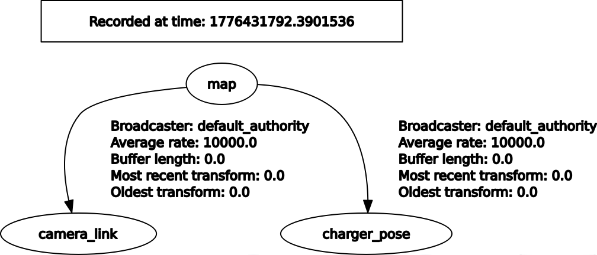
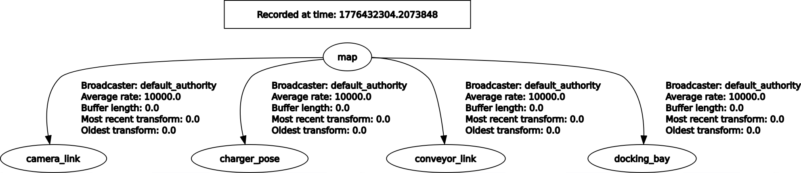

# static_tf_publisher

`static_tf_publisher` publishes static transforms into the TF tree from a ROS 2 configuration.

The package expects one collection of child frames. For each child frame, the configuration defines:
- `parent_frame`
- `pose.x`
- `pose.y`
- `pose.z`
- `pose.R`
- `pose.P`
- `pose.Y`

The pose is always interpreted as the pose of the child frame with respect to its parent frame.

## Usage

The package launch file accepts two input forms:
- `params_file`: YAML file with `ros__parameters`
- `frames_inline`: inline JSON object

Both input forms can be used at the same time. The node first loads the frames from `params_file` and then applies the frames received through `frames_inline`.

This means the command line has higher priority than the parameter file. If the same child frame is defined in both places, the definition from `frames_inline` overrides the one from `params_file`.

### Example with `params_file`

The following YAML file is enough to publish two static transforms:

```yaml
/**/static_tf_publisher:
  ros__parameters:
    use_sim_time: false
    frames:
      camera_link:
        parent_frame: map
        pose:
          x: 0.0
          y: 0.0
          z: 1.0
          R: 0.0
          P: 0.0
          Y: 0.0

      charger_pose:
        parent_frame: map
        pose:
          x: 2.0
          y: 3.0
          z: 0.0
          R: 0.0
          P: 0.0
          Y: 1.57
```

Save it as `/tmp/static_tf_publisher_example.yaml` and launch the node with:

```bash
ros2 launch static_tf_publisher static_tf_publisher.launch.py params_file:=/tmp/static_tf_publisher_example.yaml
```

This example publishes these two static transforms:
- `map -> camera_link`
- `map -> charger_pose`

### Example with `frames_inline`

This variant skips the YAML file and defines the full frame set directly on the command line:

```bash
ros2 launch static_tf_publisher static_tf_publisher.launch.py frames_inline:='{"camera_link":{"parent_frame":"map","pose":{"x":0.0,"y":0.0,"z":1.0,"R":0.0,"P":0.0,"Y":0.0}},"charger_pose":{"parent_frame":"map","pose":{"x":2.0,"y":3.0,"z":0.0,"R":0.0,"P":0.0,"Y":1.57}}}'
```

### Expected TF result

The following `rqt_tf_tree` capture shows the result of running either of the two examples above:



### Example with `params_file` and `frames_inline`

The following command mixes both input forms. The base frame set comes from the YAML above, and the command line adds or overrides frames through `frames_inline`.

```bash
ros2 launch static_tf_publisher static_tf_publisher.launch.py params_file:=/tmp/static_tf_publisher_example.yaml frames_inline:='{"conveyor_link":{"parent_frame":"map","pose":{"x":2.0,"y":0.0,"z":1.0,"R":0.0,"P":0.0,"Y":0.0}},"docking_bay":{"parent_frame":"map","pose":{"x":2.0,"y":13.0,"z":0.0,"R":0.0,"P":0.0,"Y":1.57}}}'
```

This example shows that:
- `camera_link` and `charger_pose` come from the parameter file.
- `conveyor_link` and `docking_bay` come from the command line.
- If one frame name is repeated in both inputs, the command-line definition wins.

The following `rqt_tf_tree` capture shows the result of combining the parameter file with command-line frames:


